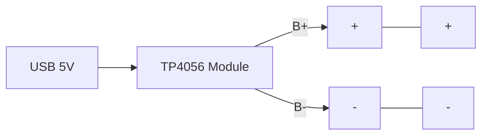
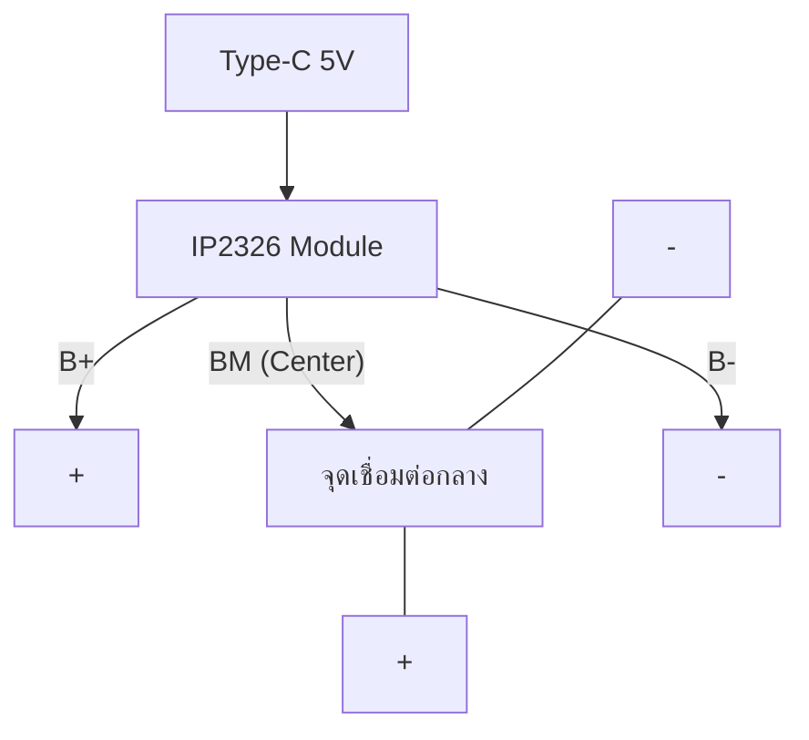

# 🔋 คู่มือผู้เชี่ยวชาญ: ระบบแบตเตอรี่และการชาร์จ (Battery Expert Guide)

การเลือกใช้แบตเตอรี่ Li-ion (3.7V) สำหรับงาน DIY มีความหลากหลายทั้งเรื่องของแรงดัน (Voltage) และกระแส (Current) เอกสารนี้จะสรุปความแตกต่างของระบบ 1S, 2S และ 3S เพื่อให้คุณเลือกใช้บอร์ดชาร์จและบอร์ดป้องกันได้อย่างถูกต้อง

---

## ⚡ 1. การเปรียบเทียบระบบ 1S, 2S และ 3S

| ระบบ             | แรงดันเฉลี่ย (Normal) | แรงดันสูงสุด (Fully Charged) | พฤติกรรมการต่อ     | การใช้งานหลัก             |
| :--------------- | :----------------- | :------------------------ | :--------------- | :---------------------- |
| **1S (1 Cell)**  | 3.7V               | 4.2V                      | ขนาน (เพิ่มความจุ)  | ESP32, Arduino, เซ็นเซอร์ |
| **2S (2 Cells)** | 7.4V               | 8.4V                      | อนุกรม (เพิ่มแรงดัน) | มอเตอร์ L298N, หุ่นยนต์เล็ก  |
| **3S (3 Cells)** | 11.1V              | 12.6V                     | อนุกรม (กำลังสูง)    | โดรน, หุ่นยนต์แขนกล        |

---

## 🔌 2. วิเคราะห์จากอุปกรณ์ (จากภาพตัวอย่าง)


*อ้างอิง: สายชาร์จ Li-ion 7.4V แบบ USB*

### วิเคราะห์ทางเทคนิค (Internal Architecture):
1. **USB 5V to 8.4V Boost Converter:** ภายในหัว USB จะมีวงจร Step-up (Boost) ที่ดันแรงดันจาก 5V ขึ้นไปที่ 8.4V เพื่อให้สูงพอที่จะชาร์จแบตเตอรี่ 2S (7.4V) ได้
2. **CC/CV Charging Logic:** มีไอซีควบคุมการชาร์จแบบ Constant Current / Constant Voltage เพื่อถนอมเซลล์แบตเตอรี่
3. **XH-3P Balance Connector:** สังเกตว่ามีสายไฟ 3 เส้น (3-Pin) ซึ่งทำหน้าที่ต่างกันดังนี้:

#### 📍 พินเอาต์ของขั้ว XH-3P (2S)
| ตำแหน่ง            | สีสายไฟ (ทั่วไป) | หน้าที่                   | แรงดันอ้างอิง (เทียบ GND) |
| :--------------- | :------------ | :--------------------- | :-------------------- |
| **ขวา (Pin 1)**  | แดง (Red)     | ขั้วบวกหลัก (B+)          | 7.4V - 8.4V           |
| **กลาง (Pin 2)** | เหลือง/ขาว     | จุดแยกเซลล์ (Center Tap) | 3.7V - 4.2V           |
| **ซ้าย (Pin 3)**  | ดำ (Black)     | ขั้วลบหลัก (GND)          | 0V                    |

---

## 🎨 3. ไดอะแกรมการต่อวงจร 2S (Series) แบบดั้งเดิม

เพื่อให้เห็นภาพการทำงานของ XH-3P กับแบตเตอรี่ 2 ก้อน:

```mermaid
graph TD
    subgraph Battery_2S
        C1[Cell 1: 3.7V]
        C2[Cell 2: 3.7V]
    end

    C1_P[+] -- Red Wire -- P1[XH-3P Pin 1: B+]
    C1_N[-] -- White Wire -- P2[XH-3P Pin 2: Tap]
    P2 -- Middle Tap -- C2_P[+]
    C2_N[-] -- Black Wire -- P3[XH-3P Pin 3: GND]

    style P1 fill:#f96,stroke:#333
    style P2 fill:#fff,stroke:#333
    style P3 fill:#333,stroke:#fff,color:#fff
```

> [!IMPORTANT]
> **ทำไมต้องมีสายกลาง?** สายกลางมีไว้เพื่อให้เครื่องชาร์จ (หรือสาย USB ตัวนี้) สามารถตรวจสอบแรงดันของแบตเตอรี่แต่ละก้อนแยกกันได้ เพื่อป้องกันไม่ให้ก้อนใดก้อนหนึ่งประจุไฟเกิน (Overcharge)

---

## 🛡️ 4. คำถามยอดฮิต: การต่ออนุกรม "ต้องใช้ BMS ไหม?"

**คำตอบคือ: ต้องใช้ 100% ครับ (ยกเว้น 1S)**

- **ถ้าต่ออนุกรม (2S, 3S, 4S):** หากไม่ใช้ BMS เครื่องชาร์จจะมองเห็นแค่แรงดันรวม (เช่น 8.4V) แต่มันจะไม่รู้เลยว่าก้อนที่ 1 อาจจะไฟเกิน (4.5V) และก้อนที่ 2 ไฟอ่อน (3.0V) ซึ่งจะทำให้ **แบตเตอรี่ระเบิดหรือเสื่อมสภาพทันที**
- **ถ้าต่อขนาน (1S):** ไม่จำเป็นต้องใช้ BMS (แต่ควรมีวงจรป้องกันพื้นฐาน) เพราะแรงดันของทุกก้อนจะถูกบังคับให้เท่ากันตลอดเวลาด้วยทางไฟฟ้า

---

## ⚡ 5. ตารางสรุปโมดูลชาร์จตามจำนวน Cell (1S - 4S)

| จำนวน Cell        | แรงดันชาร์จสูงสุด | โมดูลที่แนะนำ (เบอร์ชิป)                    | กระแสชาร์จ (A) | ระบบ Balance |
| :--------------- | :------------ | :------------------------------------ | :------------ | :----------- |
| **1S (1 Cell)**  | 4.2V          | **TP4056** / **IP2312**               | 1A - 3A       | ไม่จำเป็น       |
| **2S (2 Cells)** | 8.4V          | **IP2326** / **TP5100**               | 1A - 2A       | มีใน IP2326   |
| **3S (3 Cells)** | 12.6V         | **IP2326** / **ZXR3S**                | 1A - 2A       | มีใน IP2326   |
| **4S (4 Cells)** | 16.8V         | **IP2326 (บางรุ่น)** / **XL4015 CC/CV** | 2A - 5A       | ต้องมี BMS แยก |

---

## 🏷️ 6. เจาะลึกความแรง (กระแส A) ของแต่ละบอร์ด

### 🟢 1S (3.7V - แบบขนาน)
เน้นความปลอดภัยและใช้งานง่าย บอร์ดชาร์จราคาถูก
- **บอร์ดที่แนะนำ:** TP4056 (1A), IP2312 (3A Fast Charge)
- **ข้อดี:** ต่อขนานกี่ก้อนก็ได้เพื่อเพิ่มระยะเวลางาน (Capacity), ชาร์จผ่านพอร์ต USB ง่ายมาก
- **ข้อเสีย:** แรงดันต่ำเกินไปสำหรับขับมอเตอร์ขนาดใหญ่

### 🟡 2S (7.4V - แบบอนุกรม)
ให้แรงดันสูงขึ้น เหมาะกับงานขับเคลื่อน
- **บอร์ดที่แนะนำ:** 2S BMS (10A/20A), 2S Balance Charger
- **ข้อดี:** แรงดันเพียงพอสำหรับ Driver มอเตอร์ส่วนใหญ่โดยไม่ต้องใช้ Step-up
- **ข้อเสีย:** **ห้ามลืมใส่ BMS** เพราะถ้าแรงดันแต่ละก้อนไม่เท่ากัน แบตจะเสื่อมไวหรือระเบิดได้

### 🔴 3S (11.1V - แบบอนุกรม)
ระบบมาตรฐานสำหรับโดรนและงานกำลังสูง
- **บอร์ดที่แนะนำ:** 3S BMS (ต้องเลือกแบบมี Balance ในตัว)
- **ข้อดี:** จ่ายกระแสได้แรง (High Discharge)
- **ข้อเสีย:** ต้องการเครื่องชาร์จเฉพาะทาง (Balance Charger) หรือบอร์ดชาร์จแยกที่ซับซ้อน

---

## 🏷️ 5. เจาะลึก "เบอร์โมดูล" ที่มีขายในท้องตลาด

หากคุณค้นหาใน Shopee/Lazada เพื่อหาโมดูลที่ทำงานเหมือนในภาพ หรือเพื่อสร้างเครื่องชาร์จเอง นี่คือ "เบอร์" ที่นิยมที่สุด:

### 🏆 อันดับ 1: IP2326 (Type-C 2S/3S Boost Charger)
ตัวนี้คือ "ตัวจบ" สำหรับงาน DIY ในปัจจุบัน เพราะทำหน้าที่เหมือนสายชาร์จในรูปภาพของคุณ 100%
- **เบอร์ชิป:** **IP2326** (นิยมมาในบอร์ดสีดำ/เขียว มีพอร์ต Type-C)
- **ความสามารถ:** 
    - Boost จาก 5V (USB) ขึ้นเป็น 8.4V (2S) หรือ 12.6V (3S) ได้ในตัวเดียว
    - **มีระบบ Balance ในตัว (สำคัญมาก!)** โดยเชื่อมสาย Center Tap เข้าที่จุด "BM" ของบอร์ด
- **กระแส:** สูงสุด 2A-4A (ขึ้นอยู่กับแหล่งจ่าย USB QC)

### 🥈 อันดับ 2: TP5100 (1S/2S Buck Charger)
รุ่นยอดนิยมในอดีต ราคาถูกและทนทาน
- **เบอร์ชิป:** **TP5100**
- **ความสามารถ:** ชาร์จ 2S ได้ แต่ **ต้องใช้ไฟ Input 12V-15V** (ใช้ 5V ชาร์จ 2S ไม่ได้เพราะเป็น Buck Converter)
- **ข้อควรระวัง:** **ไม่มีระบบ Balance ในตัว** ต้องใช้คู่กับบอร์ด BMS แยกต่างหาก

---

## 📐 6. ไดอะแกรมการต่อวงจรแต่ละประเภท

### 🟢 1S (3.7V - Parallel) - สำหรับความจุสูง
เน้นชาร์จง่าย ใช้โมดูล **TP4056**


### 🟡 2S (7.4V - Series) - สำหรับแรงดัน (Ghost Micro V5)
ใช้โมดูล **IP2326** (เหมือนในภาพที่คุณส่งมา)


### 💎 ระบบ 4S (14.8V - 16.8V)
สำหรับรถตัดหญ้าไฟฟ้า หรือลำโพงบลูทูธขนาดใหญ่
- **โมดูลที่แนะนำ:** **XL4015 (แบบ CC/CV)** หรือโมดูล **Step-up/Step-down เฉพาะทาง**
- **กระแส:** รุ่นยอดนิยมจ่ายได้ถึง **5A** ชาร์จไวมาก
- **ข้อควรระวัง:** 4S มีพลังงานสะสมสูงมาก **สายไฟต้องหนา** และต้องใช้ **4S BMS ระดับ 40A ขึ้นไป** เท่านั้น

---

## 📊 7. ตารางสรุปขีดจำกัดกระแส (A) ของแต่ละบอร์ด

| เบอร์โมดูล   | รูปแบบการต่อ | จ่ายกระแสชาร์จ (A) | ระบบ Balance     | ราคาโดยประมาณ |
| :--------- | :--------- | :--------------- | :--------------- | :------------ |
| **TP4056** | 1S (3.7V)  | 1.0A             | ไม่จำเป็น           | 5 - 10 บาท    |
| **IP2312** | 1S (3.7V)  | 3.0A (Fast)      | ไม่จำเป็น           | 15 - 25 บาท   |
| **TP5100** | 1S/2S      | 2.0A             | **ไม่มี**          | 15 - 20 บาท   |
| **IP2326** | 2S/3S      | 2.0A - 4.0A      | **มี (Built-in)** | 35 - 55 บาท   |

---

## 💡 ข้อสรุปสำหรับคุณ:
หากคุณต้องการโมดูลที่ **"ซื้อมาแล้วใช้งานได้เหมือนสายชาร์จในรูป"** และชาร์จผ่าน USB ได้ทันที ผมแนะนำให้หาซื้อโมดูลเบอร์ **IP2326** ครับ เพราะมันคือเทคโนโลยีเดียวกับที่อยู่ในสายชาร์จคุณภาพสูงปัจจุบันครับ

> [!IMPORTANT]
> สำหรับหุ่นยนต์ Ghost Micro V5 แนะนำให้ใช้ **2S (7.4V)** เป็นหลักในการขับมอเตอร์ และใช้ **1S (3.7V)** แยกสำหรับ MCU เพื่อป้องกันสัญญาณรบกวนครับ
