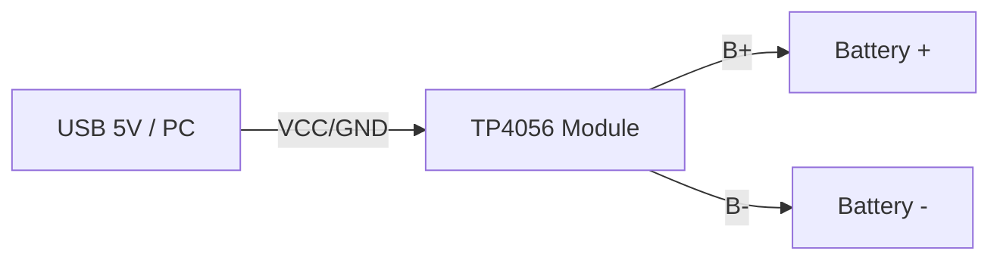
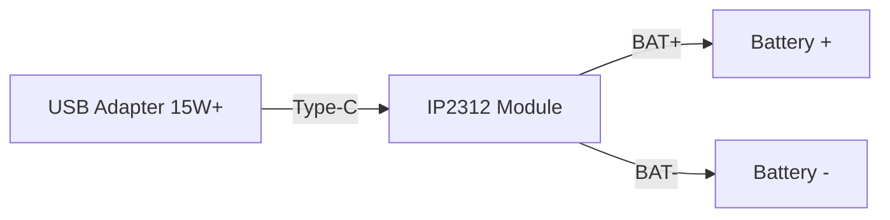
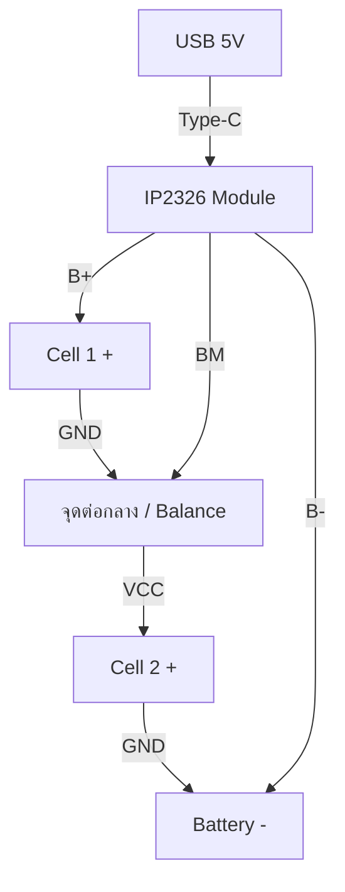
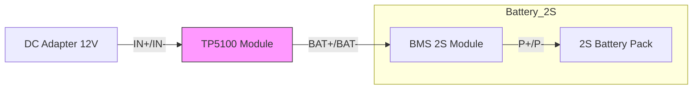
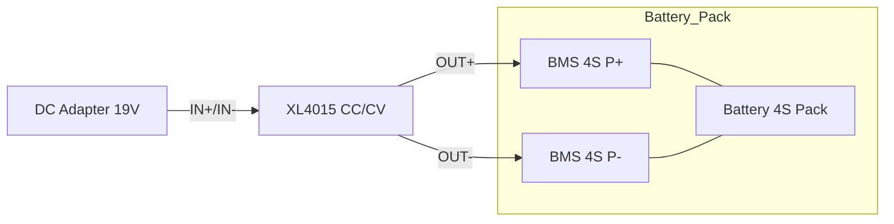

# 🔋 โครงการ: ชุดชาร์จแบตเตอรี่ DIY (1S-4S Battery Charger Station)

โปรเจกต์นี้รวบรวมวงจรการต่อใช้งานโมดูลชาร์จยอดนิยม 4 รุ่น เพื่อสร้างเครื่องชาร์จแบตเตอรี่ Li-ion ตั้งแต่ 1 เซลล์ ไปจนถึง 4 เซลล์ โดยเน้นการต่อจากแหล่งจ่ายไฟ USB และ DC Jack

---

## 🟢 1. ระบบ 1S (3.7V) - มาตรฐานและชาร์จไว

### [TP4056] - มาตรฐาน 1.0A
เหมาะสำหรับงานทั่วไป ราคาย่อมเยา
- **Input:** 5V (Micro USB / Type-C / Solder Pads)
- **Output:** 4.2V (1A)

### [IP2312] - ชาร์จไว 3.0A
เหมาะสำหรับแบตเตอรี่ความจุสูง (เช่น ต่อขนานหลายก้อน)
- **Input:** 5V (Type-C)
- **Output:** 4.2V (3A Max)

---

## 🟡 2. ระบบ 2S (7.4V) & 3S (11.1V) - ระบบ Balance

### [IP2326] - ตัวจบสาย USB (Boost)
ใช้ชาร์จแบต 2S จาก USB 5V (ดันไฟขึ้น) มีระบบ Balance ในตัว
- **Input:** 5V (Type-C)
- **Output:** 8.4V (2S)

### [TP5100] - สำหรับสาย Adapter (Buck)
ยอดนิยมสำหรับผู้ที่มีแหล่งจ่ายไฟ 12V-15V (เช่น อะแดปเตอร์ LCD) ตัวนี้ชาร์จแรงและทนทาน
- **Input:** 12V - 15V (DC Jack)
- **Output:** 8.4V (2S)
- **ข้อควรระวัง:** ไม่มีระบบ Balance ในตัว **ต้องต่อผ่าน BMS** เสมอ

> [!TIP]
> **การตั้งค่า TP5100:** ให้แต้มตะกั่ว (Short) ที่จุดเบอร์ **"SET"** บนบอร์ด เพื่อเปลี่ยนจากโหมด 1S (4.2V) เป็นโหมด **2S (8.4V)** ครับ

---

## 🔴 3. ระบบ 4S (14.8V) - กำลังสูง

### [XL4015 CC/CV] - ปรับแต่งได้อิสระ
เนื่องจาก 4S ต้องการแรงดันชาร์จถึง 16.8V เราจะใช้บอร์ด XL4015 ที่ปรับ Constant Current (CC) และ Constant Voltage (CV) ได้
- **Input:** 18V - 24V (DC Jack / Power Adapter)
- **Output:** ตั้งค่าที่ 16.8V (กระแสตามต้องการ เช่น 2A)

> [!CAUTION]
> **XL4015** เป็นเพียงบอร์ดจ่ายไฟแบบ CC/CV **ต้องใช้ควบคู่กับบอร์ด 4S BMS** เสมอเพื่อความปลอดภัย

---

## 📊 สรุปการเลือกใช้งาน

| โมดูล       | จำนวน Cell | Input     | กระแส (A) | การนำไปใช้                   |
| :--------- | :-------- | :-------- | :-------- | :------------------------- |
| **TP4056** | 1S        | USB 5V    | 1A        | โปรเจกต์ขนาดเล็ก, เซ็นเซอร์    |
| **IP2312** | 1S        | USB 5V    | 3A        | แบตความจุสูง, Power Bank     |
| **IP2326** | 2S/3S     | USB 5V    | 1-2A      | หุ่นยนต์ Ghost Micro V5, โดรน |
| **XL4015** | 1S-4S     | DC 12-30V | 5A        | เครื่องชาร์จตั้งโต๊ะ, รถตัดหญ้า    |

---

## 💡 ทิปการประกอบ
1. **สายไฟ:** แนะนำให้ใช้สายไฟซิลิโคน (AWG18-22) เพื่อให้ทนความร้อนขณะชาร์จได้ดี
2. **ระบายความร้อน:** โมดูล IP2312 และ XL4015 จะร้อนมากขณะชาร์จ ควรติดซิงค์ระบายความร้อน (Heatsink) เล็กๆ ไว้ที่ตัวชิป
3. **การวัดแรงดัน:** ก่อนต่อแบตเตอรี่เข้ากับ XL4015 ให้ใช้มัลติมิเตอร์วัดไฟขาออกและปรับ Variable Resistor ให้ได้ **16.80V เป๊ะๆ** ก่อนเสมอ
