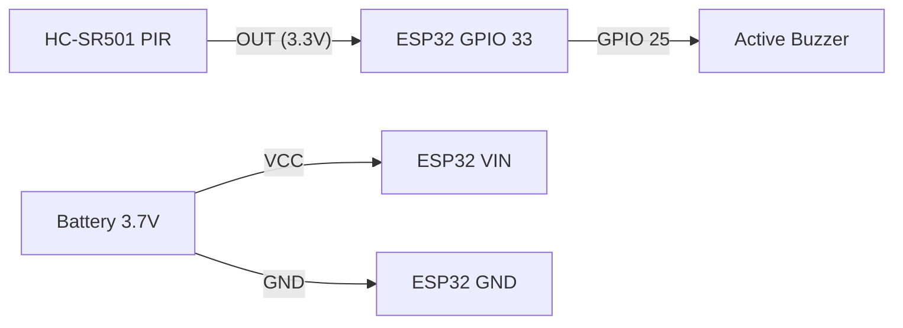

# 🏕️ โครงการ: เครื่องแจ้งเตือนผู้บุกรุกแบบพกพา (Camping Security Alarm)

โปรเจกต์นี้คืออุปกรณ์รักษาความปลอดภัยขนาดเล็กสำหรับพกพาไปแค้มปิ้ง เพื่อแจ้งเตือนเมื่อมีสัตว์ป่าหรือผู้บุกรุกเข้ามาในรัศมีรอบเต็นท์ โดยเน้นการประหยัดพลังงานสูงสุดเพื่อให้ใช้งานได้หลายคืนด้วยแบตเตอรี่ก้อนเดียว

## 🎯 คุณสมบัติหลัก
- **Ultra-Low Power:** ใช้โหมด Deep Sleep ของ ESP32 กินไฟน้อยมากขณะเฝ้าระวัง
- **Instant Alert:** ตื่นขึ้นมาส่งเสียงเตือนทันทีที่ตรวจพบการเคลื่อนไหว
- **Portability:** ออกแบบให้ใช้แบตเตอรี่ Li-ion 18650 เพียง 1 ก้อน

## 🛠️ รายการอุปกรณ์ (BOM)
| อุปกรณ์             | หน้าที่                             |
| :---------------- | :------------------------------- |
| **ESP32 DevKit**  | สมองหลัก (รองรับ Deep Sleep)       |
| **HC-SR501 PIR**  | เซ็นเซอร์ตรวจจับความร้อนคู่การเคลื่อนไหว |
| **Active Buzzer** | ลำโพงแจ้งเตือน (เลือกแบบเสียงดังพิเศษ)  |
| **Battery 18650** | แหล่งพลังงาน (3.7V - 4.2V)         |
| **Switch**        | สำหรับเปิด-ปิดเครื่อง                  |

## 🔌 การต่อวงจร (Wiring)



> [!TIP]
> **การปรับ PIR:** ปรับ Trigger ไปที่โหมด **L (Single Trigger)** และปรับ Delay ให้ต่ำที่สุดเพื่อให้ ESP32 เป็นตัวคุมเวลาการแจ้งเตือนเอง

---

## 💻 โค้ดโปรแกรม (ESP32 Deep Sleep)

โค้ดนี้จะสั่งให้ ESP32 หลับลึก และตื่นขึ้นมาเฉพาะตอนที่ PIR ส่งสัญญาณ High ออกมาเท่านั้น

```cpp
#include <Arduino.h>

#define PIR_PIN    GPIO_NUM_33  // พินที่รับสัญญาณจาก PIR
#define BUZZER_PIN 25           // พินที่ต่อกับ Buzzer

void setup() {
  Serial.begin(115200);
  pinMode(BUZZER_PIN, OUTPUT);
  
  // ตรวจสอบว่าตื่นขึ้นมาเพราะอะไร
  esp_sleep_wakeup_cause_t wakeup_reason = esp_sleep_get_wakeup_cause();
  
  if (wakeup_reason == ESP_SLEEP_WAKEUP_EXT0) {
    Serial.println("พบการเคลื่อนไหว! เริ่มการแจ้งเตือน...");
    
    // แจ้งเตือน 5 วินาที
    for(int i=0; i<10; i++) {
      digitalWrite(BUZZER_PIN, HIGH);
      delay(200);
      digitalWrite(BUZZER_PIN, LOW);
      delay(200);
    }
  }

  Serial.println("เข้าสู่โหมดเฝ้าระวัง (Deep Sleep)...");
  
  // ตั้งค่าให้ตื่นเมื่อ PIR_PIN เป็น HIGH (EXT0 Wakeup)
  esp_sleep_enable_ext0_wakeup(PIR_PIN, 1); 
  
  // เข้าสู่ Deep Sleep
  esp_deep_sleep_start();
}

void loop() {
  // ไม่มีการทำงานใน loop เพราะเครื่องจะหลับอยู่ตลอด
}
```

---

## 💡 คำแนะนำการใช้งาน
1. **การติดตั้ง:** วางอุปกรณ์สูงจากพื้นประมาณ 0.5 - 1 เมตร หันหน้าเซ็นเซอร์ไปยังทิศทางที่คาดว่าเป้าหมายจะเดินผ่าน
2. **ขอบเขต:** HC-SR501 มีรัศมีประมาณ 3-7 เมตร และมุมกว้าง 110 องศา
3. **การประหยัดไฟ:** หากต้องการให้อยู่ได้นานขึ้น ควรแกะเอา LED แสดงสถานะบนบอร์ด ESP32 ออก เพื่อลดกระแสรั่วไหลขณะหลับ

> [!CAUTION]
> PIR Sensor อาจตรวจพบลมพัดแรงๆ ที่พาความร้อนมาได้ (False Alarm) ควรติดตั้งในจุดที่ไม่มีใบไม้บังหนาแน่นเกินไป
